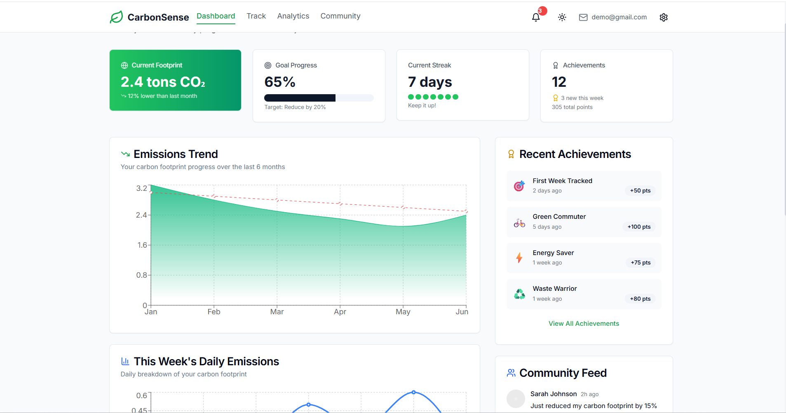
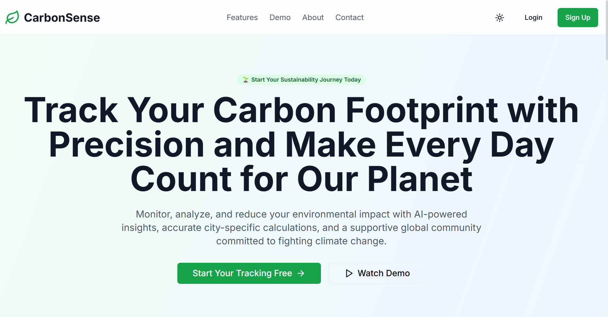
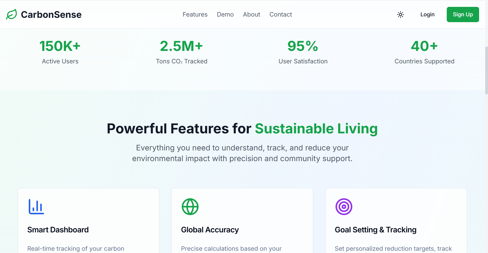
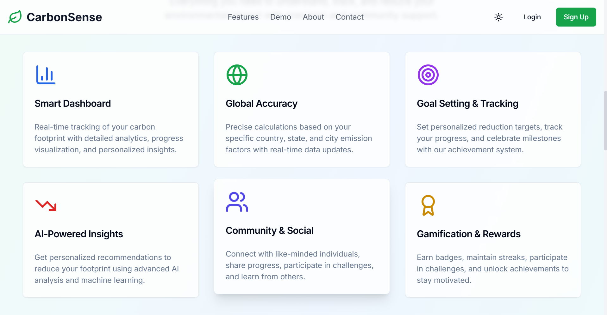
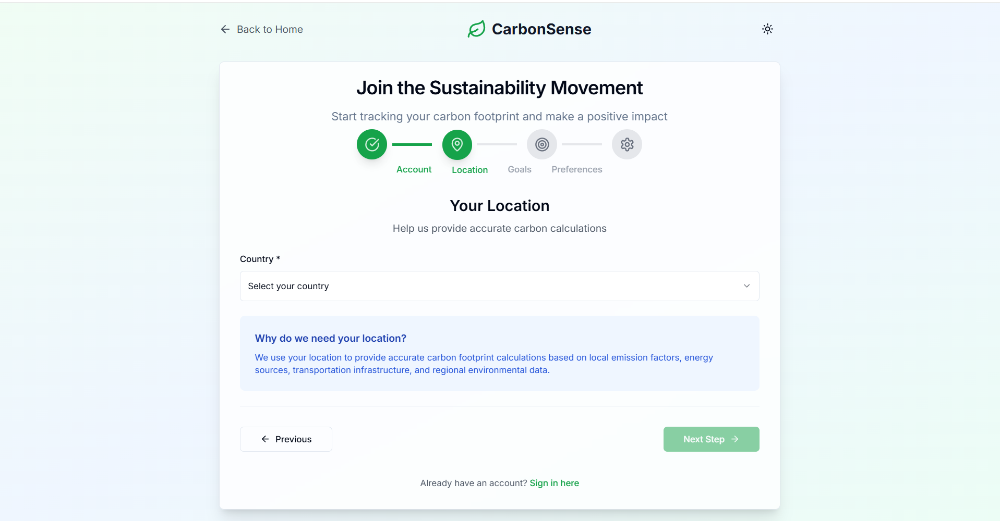
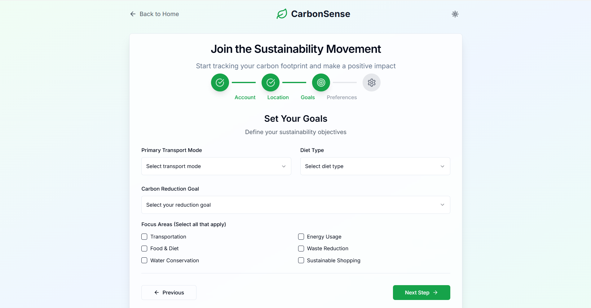
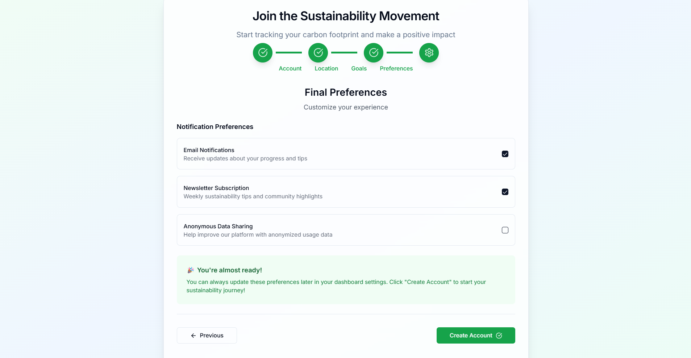

# 🌱 CarbonSense – Smart Carbon Footprint Tracker

> **Your personal AI-powered assistant for tracking and reducing carbon emissions.**  
CarbonSense helps you monitor your daily activities, analyze your carbon footprint, and adopt eco-friendly habits with actionable AI suggestions, gamification, and a social feed.

---

## 🚀 Features

- **User Authentication** – Secure Sign Up / Login with JWT.
- **Dashboard & Analytics** – Visual carbon emission insights (weekly, monthly).
- **AI-Powered Suggestions** – Personalized tips to reduce emissions.
- **Gamification** – Achievements, badges, and progress streaks.
- **Social Feed** – Share achievements with the community.
- **Dynamic Themes** – Light/Dark/System theme toggle.
- **Walkthrough Demo** – New users get guided onboarding.
- **Accurate Data** – City/state/country-based emission factors.
- **Social Sharing** – Share your progress on social media.

---

## 🛠 Tech Stack

**Frontend:**  
React.js • Tailwind CSS • Recharts • Framer Motion • Shadcn UI

**Backend:**  
Node.js • Express.js • MongoDB (Mongoose) • JWT Authentication • REST APIs

**Other Tools:**  
Docker • Vercel • GitHub Actions (CI/CD)

---

## 📸 Screenshots

### **Dashboard**


### **Homepages**
<p align="center">
  
  
  
  
  
  
  
  
</p>

---

   ## ⚡ Installation & Setup

   1. **Install dependencies:**
      ```bash
      npm install
      ```

   2. **Run the development server:**
      ```bash
      npm run dev
      ```

   3. **Build for production:**
      ```bash
      npm run build
      ```
---

## 🤝 Contributing
Contributions, issues, and feature requests are welcome!  
Feel free to **fork this repo**, create a new branch, and submit a pull request.

---

## ✨ Author
**Deepanshu Gunwant**  
[GitHub](https://github.com/Deepanshu-Gunwant) | [LinkedIn](https://linkedin.com/in/deepanshu-gunwant)

---

## ❤️ Made With Love
This project is made with ❤️ by **Deepanshu Gunwant**.

